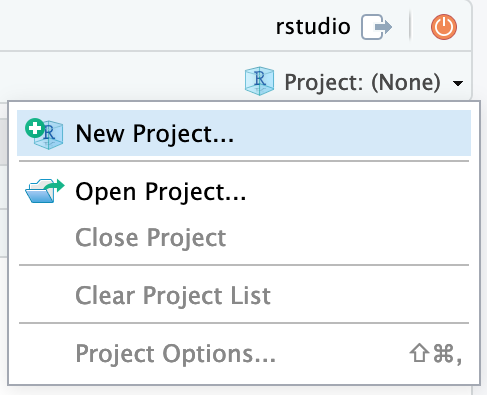
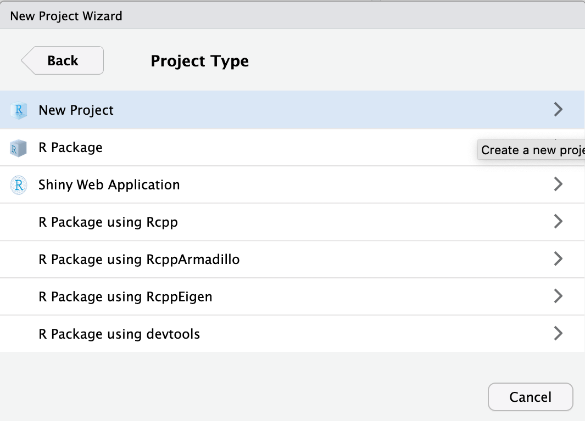
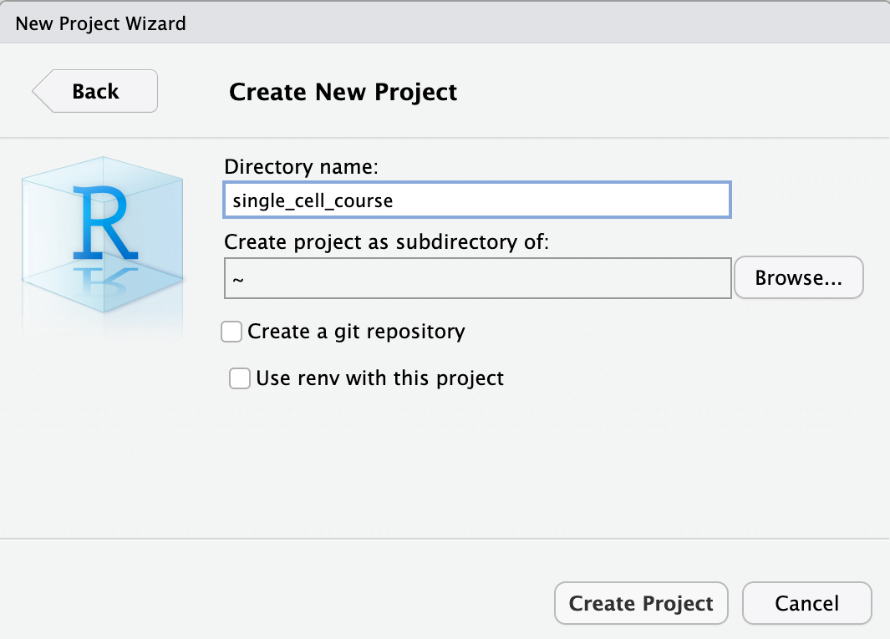

## Learning outcomes

**After having completed this chapter you will be able to:**

- Explain what kind of information single cell RNA-seq can give you to answer a biological question
- Describe essential considerations during the design of a single cell RNA-seq experiment
- Describe the pros and cons of different single cell sequencing methods
- Load single cell data into R
- Explain the basic structure of a `Seurat` object and extract count data and metadata
- Perform a basic quality control by:
    - Evaluating the percentage of UMIs originating from mitochondrial genes
    - Detecting doublets


## Material

[:fontawesome-solid-file-pdf: Download the presentation](../assets/pdf/introduction_scRNAseq.pdf){: .md-button }

- Single cell introductory [video on iBiology](https://www.youtube.com/watch?v=k9VFNLLQP8c)
- Seurat [website](https://satijalab.org/seurat/)
- [Paper](https://doi.org/10.3389/fcell.2018.00108) on experimental considerations
- [Paper](https://doi.org/10.1093/bib/bby007) on experimental design
- [SMART-seq3 protocol](https://www.protocols.io/view/smart-seq3-protocol-bcq4ivyw) at protocols.io

## Exercises

### Login and set up

Log in to Rstudio server with the provided link and password, your username is `rstudio`.

First, we will set up a project in a new directory. On the top right choose the button **Project (None)** and select **New Project...**

<figure>
  
</figure>

Continue by choosing **New Directory**

<figure>
  
</figure>

As project type select **New Project**

<figure>
  
</figure>

Finally, type in the project name. This should be `single_cell_course`. Finish by clicking **Create Project**.

<figure>
  
</figure>

Now that we have setup a project and a project directory (it is in `/home/rstudio/single_cell_course`), we can download the data that is required for this course. We will use the built-in terminal of Rstudio. To do this, select the **Terminal** tab:

<figure>
  
</figure>

### Downloading the course data

To download and extract the dataset, copy-paste these commands inside the terminal tab:

```sh
wget https://single-cell-transcriptomics.s3.eu-central-1.amazonaws.com/scRNAseq_v2.tar.gz
tar -xvf scRNAseq_v2.tar.gz
rm scRNAseq_v2.tar.gz
```

Have a look at the data directory you have downloaded. It should contain the following:

```
./data
├── deng_dataset
│   └── deng-reads.rds
├── gbm_dataset
│   ├── de_genes_gbm_res.0.2.csv
│   ├── dissocation_genes.txt
│   ├── filtered_feature_bc_matrix
│   │   ├── barcodes.tsv.gz
│   │   ├── features.tsv.gz
│   │   └── matrix.mtx.gz
│   └── h.all.v7.2.symbols.xls
└── pancreas_dataset
    ├── pancreas_expression_matrix.rds
    └── pancreas_metadata.rds
```

We will be working with three different datasets:

- :fontawesome-solid-ribbon: **gbm dataset**: Transcriptomes of human glioblastoma multiforme cells, generated by 10x genomics. This will be our most used dataset, we will use it throughout the course. Source: [10x datasets](https://support.10xgenomics.com/single-cell-gene-expression/datasets)
- :fontawesome-solid-disease: **pancreas dataset**: Pancreas cell dataset generated with four different methods. We will use it for integration and differential gene expression analysis. Soure: *Stuart T et al. Comprehensive Integration of Single-Cell Data. Cell.  2019;177:1888-1902.e21*
- :material-transit-connection-variant: **deng dataset**: Cells from different stages of mouse preimplantation development, which we will use for trajectory analysis at day 3. Source: *Deng Q, et al., Single-Cell RNA-Seq Reveals Dynamic, Random Monoallelic Gene Expression in Mammalian Cells. Science; 2014;343:193–6*

### Loading scRNAseq data

> :fontawesome-solid-ribbon: This part uses the `gbm` dataset

Today we will mainly work with the package `Seurat`. Load it into your environment like this:

```R
library(Seurat)
```

To run through a typical `Seurat` analysis, we will use the files that are in the directory `data/filtered_feature_bc_matrix`. This directory is part of the output generated by `cellranger`. To load in this data into R and generate a sparse matrix, run the following command:

```R
gbm.data <- Seurat::Read10X(data.dir = "data/gbm_dataset/filtered_feature_bc_matrix/")
```

Basically, this imports a raw count matrix. Have a look at the counts of the first 30 cells of three genes by running:

```R
gbm.data[c("PECAM1", "CD8A", "TSPAN1"), 1:30]
```

To generate a `Seurat` object, we will run `CreateSeuratObject`. We choose to import only features (genes) that are expressed in at least 3 cells, and we include only cells that express 100 or more genes (features):

```R
gbm <- Seurat::CreateSeuratObject(counts = gbm.data,
                                  project = "gbm",
                                  min.cells = 3,
                                  min.features = 100)
```

!!! note "Function notation with `::`"
    Here, we define the function together with its associated package. We do that by the syntax `package::function`. Of course, you can also call `library(package)`, and only type the function name. Since we use many different packages in this course, it can be confusing which function comes from which package. Therefore, we chose to always associate the package with the called function.

**Exercise:** check what's in the `gbm` object, by typing `gbm` in the R console. How many features are in there? And how many cells?

??? done "Answer"
    Typing `gbm` should return:

    ```
    An object of class Seurat
    24363 features across 5553 samples within 1 assay
    Active assay: RNA (24363 features, 0 variable features)
    ```

    This means that we have 24363 genes (features) in there, and 5553 cells (samples)

### The `Seurat` object

The `gbm` object we have created has the class `Seurat`. The object structure is rather complex, since it contains multi-level lists and slots.

**Exercise:**

A. Have a look at the `gbm` object by running `str(gbm)`. What is in there? Where in the object is the count data stored?

B. Have a look at the `data.frame` stored at `gbm@meta.data` what kind of information is in there?

??? done "Answer"
    === "Answer A"

        Running `str(gbm)` shows you that the object contains many slots with different classes. The count data is both stored in `gbm@assays$RNA@counts` and `gbm@assays$RNA@data`.

        ```
        Formal class 'Seurat' [package "SeuratObject"] with 13 slots
        ..@ assays      :List of 1
        .. ..$ RNA:Formal class 'Assay' [package "SeuratObject"] with 8 slots
        .. .. .. ..@ counts       :Formal class 'dgCMatrix' [package "Matrix"] with 6 slots
        .. .. .. .. .. ..@ i       : int [1:19378876] 18 67 82 116 118 158 173 227 240 281 ...
        .. .. .. .. .. ..@ p       : int [1:5554] 0 815 5575 7894 11289 14005 15664 16654 16792 19905 ...
        .. .. .. .. .. ..@ Dim     : int [1:2] 24363 5553
        .. .. .. .. .. ..@ Dimnames:List of 2
        .. .. .. .. .. .. ..$ : chr [1:24363] "AL627309.1" "AL627309.5" "AP006222.2" "LINC01409" ...
        .. .. .. .. .. .. ..$ : chr [1:5553] "AAACCCAAGGCGATAC-1" "AAACCCACAAGTCCCG-1" "AAACCCACAGATGCGA-1" "AAACCCACAGGTGAGT-1" ...
        .. .. .. .. .. ..@ x       : num [1:19378876] 1 1 1 1 5 1 1 1 1 1 ...
        .. .. .. .. .. ..@ factors : list()
        .. .. .. ..@ data         :Formal class 'dgCMatrix' [package "Matrix"] with 6 slots
        .. .. .. .. .. ..@ i       : int [1:19378876] 18 67 82 116 118 158 173 227 240 281 ...
        .. .. .. .. .. ..@ p       : int [1:5554] 0 815 5575 7894 11289 14005 15664 16654 16792 19905 ...
        .. .. .. .. .. ..@ Dim     : int [1:2] 24363 5553
        .. .. .. .. .. ..@ Dimnames:List of 2
        .. .. .. .. .. .. ..$ : chr [1:24363] "AL627309.1" "AL627309.5" "AP006222.2" "LINC01409" ...
        .. .. .. .. .. .. ..$ : chr [1:5553] "AAACCCAAGGCGATAC-1" "AAACCCACAAGTCCCG-1" "AAACCCACAGATGCGA-1" "AAACCCACAGGTGAGT-1" ...
        .. .. .. .. .. ..@ x       : num [1:19378876] 1 1 1 1 5 1 1 1 1 1 ...
        .. .. .. .. .. ..@ factors : list()
        .. .. .. ..@ scale.data   : num[0 , 0 ]
        .. .. .. ..@ key          : chr "rna_"
        .. .. .. ..@ assay.orig   : NULL
        .. .. .. ..@ var.features : logi(0)
        .. .. .. ..@ meta.features:'data.frame':	24363 obs. of  0 variables
        .. .. .. ..@ misc         : list()
        ..@ meta.data   :'data.frame':	5553 obs. of  3 variables:
        .. ..$ orig.ident  : Factor w/ 1 level "gbm": 1 1 1 1 1 1 1 1 1 1 ...
        .. ..$ nCount_RNA  : num [1:5553] 2225 17882 8172 9057 5612 ...
        .. ..$ nFeature_RNA: int [1:5553] 815 4760 2319 3395 2716 1659 990 138 3113 6045 ...
        ..@ active.assay: chr "RNA"
        ..@ active.ident: Factor w/ 1 level "gbm": 1 1 1 1 1 1 1 1 1 1 ...
        .. ..- attr(*, "names")= chr [1:5553] "AAACCCAAGGCGATAC-1" "AAACCCACAAGTCCCG-1" "AAACCCACAGATGCGA-1" "AAACCCACAGGTGAGT-1" ...
        ..@ graphs      : list()
        ..@ neighbors   : list()
        ..@ reductions  : list()
        ..@ images      : list()
        ..@ project.name: chr "gbm"
        ..@ misc        : list()
        ..@ version     :Classes 'package_version', 'numeric_version'  hidden list of 1
        .. ..$ : int [1:3] 4 0 1
        ..@ commands    : list()
        ..@ tools       : list()
        ```

    === "Answer B"
        Running `head(gbm@meta.data)` returns:

        ```
                            orig.ident nCount_RNA nFeature_RNA
        AAACCCAAGGCGATAC-1        gbm       2225          815
        AAACCCACAAGTCCCG-1        gbm      17882         4760
        AAACCCACAGATGCGA-1        gbm       8172         2319
        AAACCCACAGGTGAGT-1        gbm       9057         3395
        AAACCCAGTCTTGCGG-1        gbm       5612         2716
        AAACCCATCGATAACC-1        gbm       6254         1659
        ```

        Giving you the names of three columns and a row for each cell:

        * `orig_ident`: the original identity (origin) of a cell.
        * `nCount_RNA`: the number of reads assigned to a cell.
        * `nFeature_RNA`: the number of expressed features (genes) per cell.

Luckily, usually you do not have to dive into this structure to retrieve information. For example, information in the slot `@meta.data` can be retrieved and set by using `$` or `[[]]`.

!!! note
    There is a subtle difference here between `$` and `[[]]`. While `$` returns a vector of the column in `@meta.data`, `[[]]` returns a `data.frame`.


 **Exercise:** Generate a histogram of the column `nCount_RNA` at `gbm@meta.data`, with the base function `hist`.

??? done "Answer"
    ```R
    hist(gbm$nCount_RNA)
    ```

    or

    ```R
    hist(gbm@meta.data$nCount_RNA)
    ```

There are also built-in functions to plot data from `Seurat` object, for example `FeatureScatter`. This function enables you easily draw a scatterplot from a `Seurat` object:

```R
Seurat::FeatureScatter(gbm, feature1 = "nCount_RNA", feature2 = "nFeature_RNA")
```

### Basic Quality Control

A high number of UMIs originating from mitochondrial genes can point to dying cells. In order to calculate the percentage of UMIs coming from mitochondrial genes for each cell, we use the function `PercentageFeatureSet`. In our count matrix, the names of mitochondrial genes all start with `MT-`, so we can use that pattern to search these genes:

```R
gbm[["percent.mt"]] <- Seurat::PercentageFeatureSet(gbm, pattern = "^MT-")
```

!!! note "Finding mitochondrial genes for mouse"
    For mouse, mitochondrial genes start with `mt-`, so the function call with look like this:

    ```R
    gbm[["percent.mt"]] <- Seurat::PercentageFeatureSet(gbm, pattern = "^mt-")
    ```

Now check out whether the column was added to the `meta.data` slot:

```R
head(gbm@meta.data)
```

Let's have a look at the distribution of the three columns stored in `@meta.data`:

```R
Seurat::VlnPlot(gbm, features = c("nFeature_RNA", "nCount_RNA", "percent.mt"), ncol = 3)
```

There is often a relationship between number of UMIs and percentage of mitochondrial genes. We can have a look at their relationship:

```R
Seurat::FeatureScatter(gbm, feature1 = "nCount_RNA", feature2 = "percent.mt")
```

Based on what we know now, it would be sensible to keep cells that express between 500 and 7500 features, and in which less than 20% of the UMIs come from mitochondrial genes. We can filter like this:

```R  
gbm <- subset(gbm,
              subset = nFeature_RNA > 500 & nFeature_RNA < 7500 & percent.mt < 20)
```

**Exercise:** How many cells did we filter out?

??? done "Answer"
    Just running `gbm` returns:
    ```
    An object of class Seurat
    24363 features across 5091 samples within 1 assay
    Active assay: RNA (24363 features, 0 variable features)
    ```

    Meaning that 5553 - 5091 = 462 cells were filtered out.
