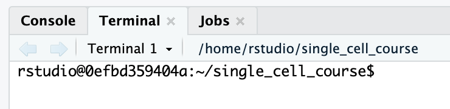
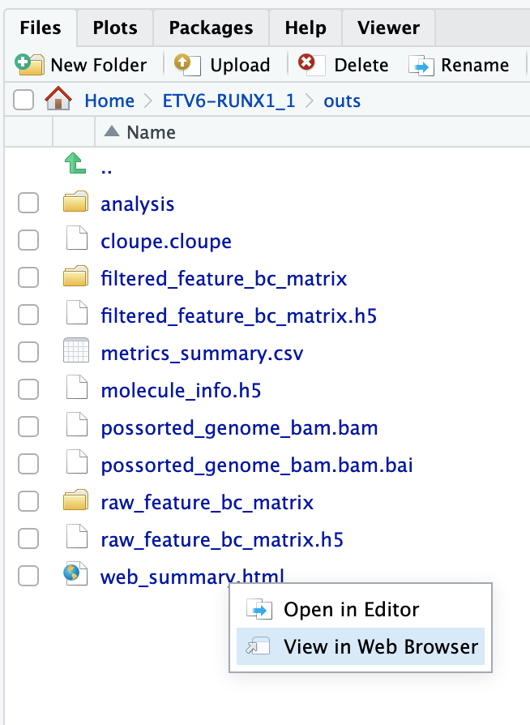

## Learning outcomes

**After having completed this chapter you will be able to:**

- Explain what kind of information single cell RNA-seq can give you to answer a biological question
- Describe essential considerations during the design of a single cell RNA-seq experiment
- Describe the pros and cons of different single cell sequencing methods
- Load single cell data into R
- Explain the basic structure of a `Seurat` object and extract count data and metadata
- Perform a basic quality control by:
    - Evaluating the percentage of UMIs originating from mitochondrial genes
    - Detecting doublets


## Material

[:fontawesome-solid-file-pdf: Download the presentation](../assets/pdf/introduction_scRNAseq.pdf){: .md-button }

- Single cell introductory [video on iBiology](https://www.youtube.com/watch?v=k9VFNLLQP8c)
- Seurat [website](https://satijalab.org/seurat/)
- [Paper](https://doi.org/10.3389/fcell.2018.00108) on experimental considerations
- [Paper](https://doi.org/10.1093/bib/bby007) on experimental design
- [SMART-seq3 protocol](https://www.protocols.io/view/smart-seq3-protocol-bcq4ivyw) at protocols.io
- `cellranger` [system requirements](https://support.10xgenomics.com/single-cell-gene-expression/software/overview/system-requirements) and [installation](https://support.10xgenomics.com/single-cell-gene-expression/software/pipelines/latest/installation)
- [Review](https://www.nature.com/articles/s41596-020-00409-w?proof=t) by Tallulah Andrews
- [Paper](https://www.biorxiv.org/content/10.1101/749473v3.full) on correlation between mRNA and protein level in single cells

### Running `cellranger count`

Have a look in the directory `course_data/reads` and `reference`. In the `reads` directory you will find reads on one sample: `ETV6-RUNX1_1`. In the analysis part of the course we will work with six samples, but due to time and computational limitations we will run `cellranger count` on one of the samples, and only reads originating from chromsome 21 and 22. 

The input you need to run `cellranger count` are the sequence reads and a reference. Here, we have prepared a reference only with chromosome 21 and 22, but in 'real life' you would of course get the full reference genome of your species. The reference has a specific format. You can download precomputed human and mouse references from the [10X website](https://support.10xgenomics.com/single-cell-gene-expression/software/downloads/latest). If your species of interest is not one of those, you will have to generate it yourself. For that, have a look [here](https://support.10xgenomics.com/single-cell-gene-expression/software/pipelines/latest/using/tutorial_mr).

Have a look at the documentation of [`cellranger count`](https://support.10xgenomics.com/single-cell-gene-expression/software/pipelines/latest/using/count) (scroll down to *Command-line argument reference*).

You can find the input files here:

- reads: `/home/rstudio/course_data/reads/` (from the downloaded tar package in your home directory)
- pre-indexed reference: `/group_work/cellranger_index`

Fill out the missing arguments (at `FIXME`) in the script below, and run it:

```sh
cellranger count \
--id=FIXME \
--sample=FIXME \
--transcriptome=FIXME \
--fastqs=FIXME \
--localcores=4 
```

!!! note "This will take a while.."
    Once started, the process will need approximately 15 minutes to finish. Have a coffee and/or have a look at the other exercises. 

!!! hint "Running a bash command with Rstudio"
    You can run a bash script or command using the terminal tab in Rstudio server: 
    <figure>
    
    </figure>

??? done "Answer"
    ```sh
    cellranger count \
    --id=ETV6-RUNX1_1 \
    --sample=ETV6-RUNX1_1 \
    --transcriptome=/group_work/cellranger_index \
    --fastqs=/home/rstudio/course_data/reads/ \
    --localcores=4 
    ```

Have a look out the output directory (i.e. `~/ETV6-RUNX1_1/outs`). The analysis report (`web_summary.html`) is usually a good place to start. 

!!! tip "Open html files in Rstudio server"
    You can use the file browser in the bottom right (tab "Files") to open html files:

    <figure>
    
    </figure>

**Exercise:** Have a good look inside `web_summary.html`. Anything that draws your attention? Is this report good enough to continue the analysis? 

??? done "Answer"
    Not really. First of all there is a warning: `Fraction of RNA read bases with Q-score >= 30 is low`. This means that there is a low base quality of the reads. A low base quality gives results in more sequencing error and therefore possibly lower performance while mapping the reads to genes. However, a Q-score of 30 still represents 99.9% accuracy. 

    What should worry us more is the **number of reads per cell** (363) and the **sequencing saturation** (7.9%). In most cases you should aim for 30.000 - 50.000 reads per cell, and a sequencing saturation >~70% (depending on the application). We therefore don't have enough reads per cell. However, as you might remember, this was a subset of reads (1 million) mapped against chromosome 21 & 22, while the original dataset contains 210,987,037 reads. You can check out the original report at `course_data/count_matrices/ETV6-RUNX1_1/outs/web_summary.html`.
    
    For more info on sequencing saturation, have a look [here](
    https://kb.10xgenomics.com/hc/en-us/articles/115002474263-How-much-sequencing-saturation-should-I-aim-for-). 
