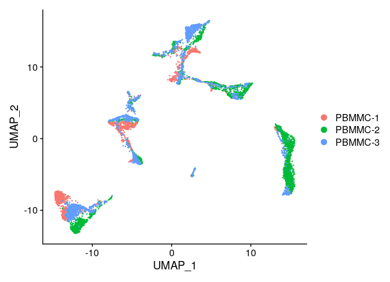

# SIB course Single Cell Transcriptomics

<figure>
    
</figure>

## Teachers

- Tania Wyss [:custom-orcid:](https://orcid.org/0000-0003-2641-0895)
- Rachel Marcone-Jeitziner [:custom-orcid:](https://orcid.org/0000-0002-5711-8435)
- Geert van Geest [:custom-orcid:](https://orcid.org/0000-0002-1561-078X)

## Authors

- Tania Wyss [:custom-orcid:](https://orcid.org/0000-0003-2641-0895)
- Rachel Marcone-Jeitziner [:custom-orcid:](https://orcid.org/0000-0002-5711-8435)
- Geert van Geest [:custom-orcid:](https://orcid.org/0000-0002-1561-078X)
- Patricia Palagi [:custom-orcid:](https://orcid.org/0000-0001-9062-6303)

## Attribution

Parts of this course are inspired by the [Broad Institute Single Cell Workshop](https://broadinstitute.github.io/2019_scWorkshop/index.html), the [CRUK CI Introduction to single-cell RNA-seq data analysis course](https://bioinformatics-core-shared-training.github.io/UnivCambridge_ScRnaSeq_Nov2021/) and courses previously developed by Walid Gharib at SIB. 

## License & copyright

**License:** [CC BY-SA 4.0](https://raw.githubusercontent.com/sib-swiss/single-cell-training/master/LICENCE)

**Copyright:** [SIB Swiss Institute of Bioinformatics](https://www.sib.swiss/)

## Learning outcomes

### General learning outcomes

After this course, you will be able to:

- distinguish advantages and pitfalls of scRNAseq
- design your own scRNA-seq experiment
- apply a downstream analysis using R

### Learning outcomes explained

To reach the general learning outcomes above, we have set a number of smaller learning outcomes. Each chapter starts with these smaller learning outcomes. Use these at the start of a chapter to get an idea what you will learn. Use them also at the end of a chapter to evaluate whether you have learned what you were expected to learn.

## Learning experiences

To reach the learning outcomes we will use lectures, exercises, polls and group work. During exercises, you are free to discuss with other participants. During lectures, focus on the lecture only.

### Exercises

Each block has practical work involved. Some more than others. The practicals are subdivided into chapters, and we'll have a (short) discussion after each chapter. All answers to the practicals are incorporated, but they are hidden. Do the exercise first by yourself, before checking out the answer. If your answer is different from the answer in the practicals, try to figure out why they are different.
